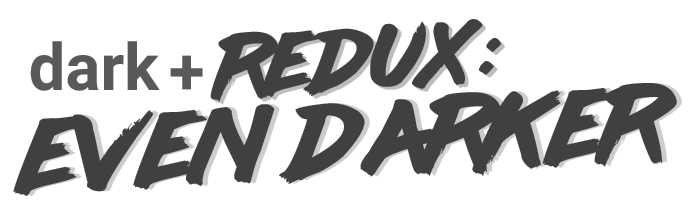
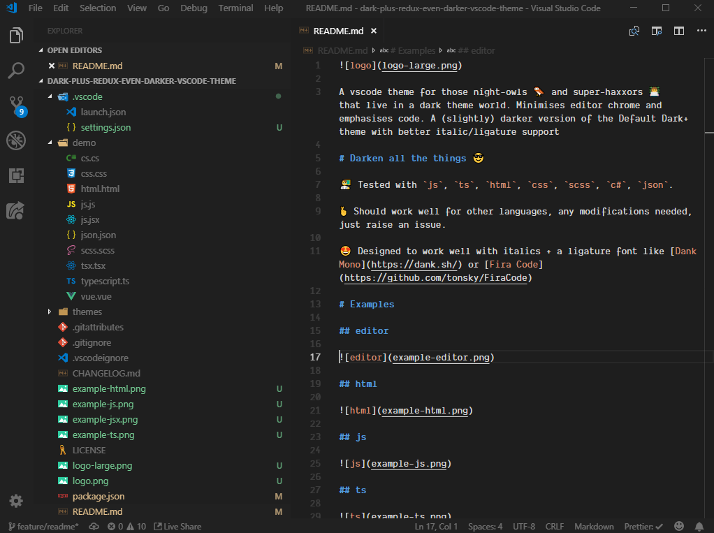
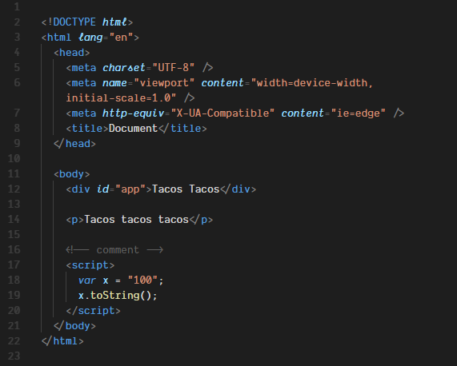
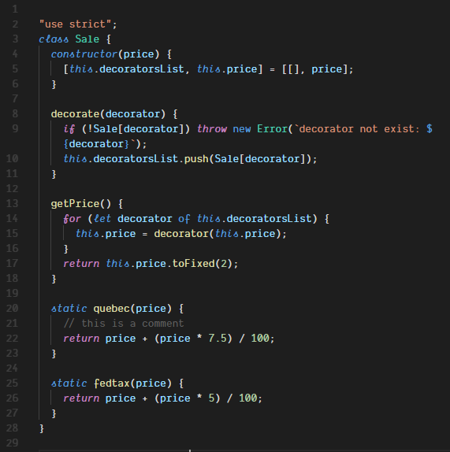
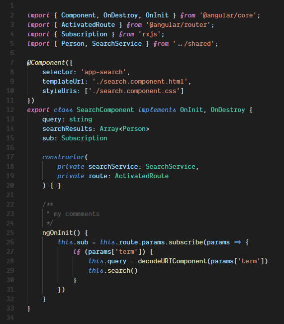
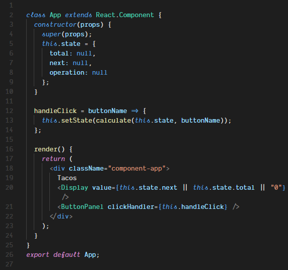

A vscode theme for those night-owls 🦉 and super-haxxors 👩‍💻 that live in a dark theme world. Minimises editor chrome and emphasises code. A (slightly) darker version of the Default Dark+ theme with better italic/ligature support

# Darken all the things 😎

👨‍🏫 Tested with `js`, `ts`, `html`, `css`, `scss`, `c#`, `json`.

🤞 Should work well for other languages, any modifications needed, just raise an issue.

😍 Designed to work well with italics + a ligature font like [Dank Mono](https://dank.sh/) or [Fira Code](https://github.com/tonsky/FiraCode)

# Examples

## editor



## html



## js



## ts



## jsx



# Extra Settings

To enable font ligatures + change the font to your desired ligature-enabled font;

```
"editor.fontFamily": "Dank Mono",
"editor.fontLigatures": true,
```

For an integrated menu bar;

```
"window.menuBarVisibility": "default",
"window.titleBarStyle": "custom",
```

# Kudos

🦉 Thanks to Sarah Drasner's ([@sarah_edo](http://twitter.com/sarah_edo)) [Night Owl Theme](https://marketplace.visualstudio.com/items?itemName=sdras.night-owl) for demo files + excellent [vscode theme write-up](https://css-tricks.com/creating-a-vs-code-theme/)

# Author

🤔 created by Dan Harris

👨‍💻 website: [danharris.io](https://danharris.io)

🐤 twitter: [@danharris_io](http://twitter.com/danharris_io)

☕ made with love and late nights

# Odds & Ends

👀 MIT License

💖 if you've read this far... thanks for the star

😎 title font courtesy of the awesome [lazer84 font](http://sunrise-digital.net/lazer84/)

😡 please send all abusive letters via handwritten note to [this address](https://www.youtube.com/watch?v=dQw4w9WgXcQ)

📫 all constructive feedback welcome.
